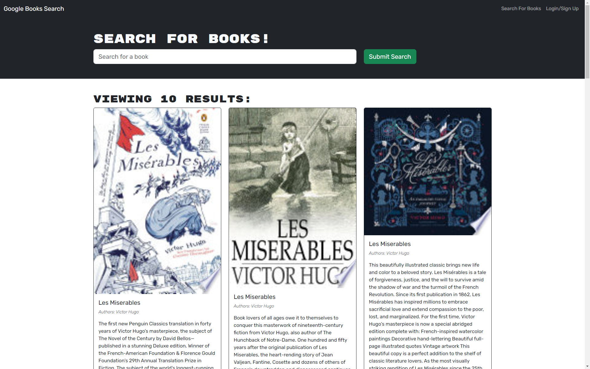

# Book Bag

## Description

This app was created in order to allow users to search for books and save them to a user-generated profile. Essentially, this application acts as a virtual bookshelf. This project involved refactoring existing code to utilize GraphQL. It also involed deploying using a new platform, Render. In order to refactor the code for this project, I had to become much more familiar with the ins and outs of using GraphQl to set up and manage a database on the back and front end of the application.

## Usage

The webpage is live and can be accessed at: https://book-bag-2.onrender.com/

## Credits

The following are people who assisted with creating this project:
* [Karina Guerrero](https://github.com/krausyd)
* [Jaytee Padilla](https://github.com/jaytee-padilla)
* Camille Bagnani
* William Rankin

---